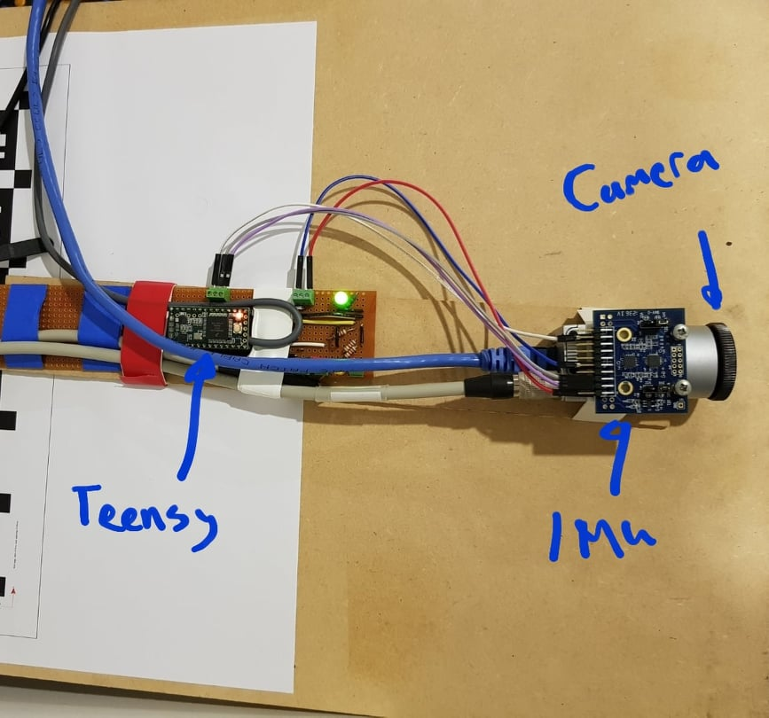
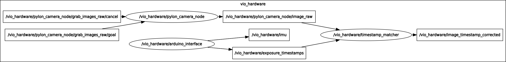

# Visual-inertial odometry hardware
This is a project to trial building a visual-inertial odometry (VIO) platform.
The main aims include:
 - **hardware synchronisation:** I understand that accurate/synchronised timestamping of IMU and camera data are important in ensuring robust VIO tracking. Hence this project uses an arduino to take care of timestamping sensor data, avoiding the timing errors that otherwise may arise when relying on a non-realtime OS to provide timestamps.
 - **targeting ROS and open source VIO packages:** The goal is to create a solid platform for testing out some of the many impressive-looking VIO systems available as ROS packages. Perhaps this coud also lead to trialling vision-based SLAM and localisation (e.g. [MAPLAB](https://github.com/ethz-asl/maplab) )

## Hardware:

Components:
 - Camera: Basler acA640-100gm
 - IMU: MPU-6050 EV Board
 - Teensy 3.2 
 - Laptop (Ubuntu 16.04.4 LTS, ROS kinetic)

In this rig the Teensy has responsibility for providing timestamps for both the imu readings and camera frames. This is expected to provide well synchronised timestamps, to aid in the downstream VIO algorithm. 

The Teensy reads the IMU over i2c and immediately timestamps the data, before seending the message over rosserial to the laptop. 

Regarding the camera input, image timestamps are determined using the camera's exposure active output, which is connected to the Teensy. From this input the image timestamp can be accurately determined. These timestamps are sent over rosserial to the laptop, where they are matched with the images received from the camera.

## References:

Hardware setup:
[http://grauonline.de/wordpress/?page_id=1951](http://grauonline.de/wordpress/?page_id=1951)

[https://riccardogiubilato.github.io/visual/odometry/2017/12/12/Visual-Inertial-Odometry-On-A-Budget.html](https://riccardogiubilato.github.io/visual/odometry/2017/12/12/Visual-Inertial-Odometry-On-A-Budget.html)

[https://github.com/TurtleZhong/Visual-Inertial-Synchronization-Hardware](https://github.com/TurtleZhong/Visual-Inertial-Synchronization-Hardware)

 IMU noise model calibration:
 https://github.com/ethz-asl/kalibr/wiki/IMU-Noise-Model

## Open project directions/questions:

 - IMU calibration: As discussed in this [maplab github issue](https://github.com/ethz-asl/maplab/issues/19#issuecomment-353033323), the MPU6050 is a low cost IMU, and may require intrinsic calibration, and some sort of node to apply calibration correction prior to passing the data to ROVIO.
 Can this be used for calibration: [http://www.i2cdevlib.com/forums/topic/96-arduino-sketch-to-automatically-calculate-mpu6050-offsets/](http://www.i2cdevlib.com/forums/topic/96-arduino-sketch-to-automatically-calculate-mpu6050-offsets/).?
 - Alternatively, should I be considering a better quality IMU? The adis16445/16448 (a $500 IMU) is recommended here: https://github.com/ethz-asl/maplab/issues/56#issuecomment-374710395 
 - micros() vs. ros::Time: It would be nice if the arduino and host PC clocks were well synchronised, so that any data timestamped on the PC is in sync with that from the arduino. However there appears to be doubt as to how well this synchronisation is currently performed in rosserial (relevant [
github issue)](https://github.com/ros-drivers/rosserial/issues/392). Hence I've chosen not to use ros::Time for arduino timestamps for now. As mentioned in the linked issue, there appears to be some work underway to address this, so perhaps I can migrate back to ros::Time in future.

